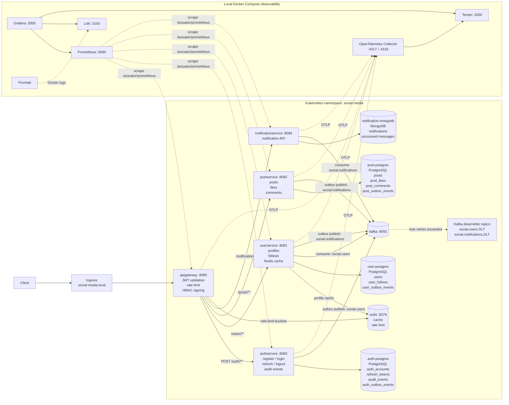

# Social Media Backend

Social Media Backend is a Kotlin/Spring Boot microservice backend for a small social network. It covers authentication, user profiles, follows, posts, likes, comments, and notification delivery through reliable Kafka-based asynchronous events.

The project is structured as a multi-module Gradle build with service-owned runtime boundaries, API gateway security, transactional outbox publishing, idempotent consumers, Docker Compose infrastructure, Kubernetes manifests, CI, metrics, tracing, and log shipping.

## Capabilities

- Public API gateway with JWT validation, auth rate limiting, circuit breakers, retries, and downstream HMAC request signing.
- Email/password registration and login with access tokens, refresh tokens, logout/revocation, roles in JWT, and auth audit events.
- Automatic user profile creation after registration through Kafka.
- User profile management, username search, followers/following, and Redis-backed profile cache.
- Post publishing, editing, deleting, feed lookup, likes, and comments.
- Notification pipeline for follows, likes, and comments, persisted in MongoDB.
- Transactional outbox for Kafka producers with retry limits, locks, failed status, cleanup, and dead-letter topic publishing.
- Idempotent Kafka consumers for profile creation and notification storage.
- PostgreSQL migrations with Flyway for relational services.
- Prometheus metrics, structured JSON logs, correlation IDs, OpenTelemetry tracing, Loki, Tempo, and Grafana provisioning.
- Docker Compose full-stack setup, per-service Dockerfiles, Kubernetes base manifests, and GitHub Actions CI.

## Architecture




The same Mermaid source is available in [docs/architecture.md](./docs/architecture.md).

## Services

| Service | Responsibility |
| --- | --- |
| [`apigateway`](./apigateway/README.md) | Public entry point, route forwarding, JWT validation, rate limiting, trusted user headers, internal HMAC signature |
| [`authservice`](./authservice/README.md) | Account registration/login, password hashing, access/refresh tokens, logout, audit events, user registration events |
| [`userservice`](./userservice/README.md) | Profiles, search, followers/following, Redis profile cache, profile auto-creation, follow notifications |
| [`postservice`](./postservice/README.md) | Posts, feed, likes, comments, post interaction notifications |
| [`notificationservice`](./notificationservice/README.md) | Kafka notification consumer, MongoDB notification records, read/unread state |

Supporting infrastructure includes PostgreSQL, Redis, Kafka, MongoDB, Prometheus, Grafana, Loki, Tempo, Promtail, and the OpenTelemetry Collector.

## Repository Layout

```text
apigateway/             # gateway, JWT validation, rate limiting, service routing
authservice/            # auth accounts, access/refresh tokens, audit log, auth outbox
userservice/            # user profiles, follows, Redis cache, Kafka consumer/producer
postservice/            # posts, likes, comments, post notification outbox
notificationservice/    # notification records, idempotent Kafka consumer
k8s/                    # Kubernetes base manifests
observability/          # Prometheus, Grafana, Loki, Tempo, Promtail, OTel config
docker-compose.yml      # local full-stack runtime
settings.gradle.kts     # Gradle multi-module setup
build.gradle.kts        # shared build configuration
```

## Local Ports

| Component | Port | Purpose |
| --- | ---: | --- |
| API Gateway | `8080` | Public HTTP API |
| User Service | `8081` | User profile API |
| Post Service | `8082` | Posts API |
| Auth Service | `8083` | Auth API |
| Notification Service | `8084` | Notifications API |
| PostgreSQL | `5432` | Relational data |
| Redis | `6379` | Cache and gateway rate limiting |
| MongoDB | `27017` | Notification documents |
| Kafka internal | `9092` | Container-to-container Kafka traffic |
| Kafka external | `19092` | Host-to-Kafka access |
| Grafana | `3000` | Dashboards |
| Prometheus | `9090` | Metrics |
| Loki | `3100` | Logs |
| Tempo | `3200` | Traces |
| OTel Collector | `4317`, `4318` | OTLP gRPC/HTTP |

## Distributed Flow

Registration starts in `authservice`. The account is saved in PostgreSQL, an audit event is recorded, and a `UserRegisteredEvent` is stored in `auth_outbox_events`. `OutboxPublisher` publishes it to Kafka topic `social.users`; `userservice` consumes it idempotently and creates a default profile.

Follow, like, and comment actions create notification events through service-local outbox tables. `notificationservice` consumes `social.notifications` idempotently and stores notification records in MongoDB.

Outbox publishers use retry counters, short locks, failed status, cleanup for old published events, and dead-letter publishing to `${topic}.DLT` after the retry limit is reached.

## Security

- Login, registration, refresh, and logout are public auth endpoints.
- Other gateway requests require `Authorization: Bearer <accessToken>`.
- Access tokens contain the user id as JWT subject, email, roles, and scope.
- Refresh tokens are stored only as SHA-256 hashes and can be revoked through logout.
- Gateway validates JWT and forwards trusted context with `X-User-Id` and optional `X-User-Email`.
- Gateway signs downstream requests with `X-TS` and `X-SIGN`.
- Internal services validate gateway signature and timestamp before accepting protected requests.
- Gateway applies Redis-backed rate limiting to `/auth/**`.
- Auth service writes audit events for register, login, refresh, and logout.

Use secrets at least 32 characters long:

```text
JWT_SECRET
GATEWAY_INTERNAL_SIGNING_SECRET
```

## Observability

- `/actuator/prometheus` is exposed by every service.
- Prometheus scrapes gateway and service metrics.
- Logs are emitted as JSON with correlation fields.
- `X-Correlation-Id` is generated by the gateway and propagated downstream.
- Micrometer tracing exports OTLP traces to the OpenTelemetry Collector.
- OTel Collector exports traces to Tempo.
- Promtail reads Docker container logs and pushes them to Loki.
- Grafana is provisioned with Prometheus, Loki, and Tempo datasources.

## Local Run

Requirements:

- JDK 21
- Docker with Docker Compose

Build jars first because the Dockerfiles copy `build/libs/*.jar`:

```powershell
.\gradlew.bat build
```

Start the full local stack:

```powershell
docker compose up --build
```

The public API is available at:

```text
http://localhost:8080
```

Grafana is available at:

```text
http://localhost:3000
```

For local development without containerized app services, start infrastructure and run services from Gradle:

```powershell
docker compose up -d postgres redis mongodb kafka prometheus grafana loki tempo otel-collector promtail
.\gradlew.bat :apigateway:bootRun
.\gradlew.bat :authservice:bootRun
.\gradlew.bat :userservice:bootRun
.\gradlew.bat :postservice:bootRun
.\gradlew.bat :notificationservice:bootRun
```

## API Entry Points

| Area | Main paths |
| --- | --- |
| Auth | `POST /auth/register`, `POST /auth/login`, `POST /auth/refresh`, `POST /auth/logout` |
| Users | `/users`, `/users/{id}`, `/users/{id}/profile`, `/users/search`, `/users/{id}/follow` |
| Posts | `/posts`, `/posts/feed`, `/posts/{id}/likes`, `/posts/{id}/comments` |
| Notifications | `/notifications`, `/notifications/unread-count`, `/notifications/{id}/read` |

## Kubernetes

Base manifests are under [k8s/base](./k8s/base). They include app deployments, services, ingress, config map, example secret, resource limits, probes, and PVCs for PostgreSQL and MongoDB.

```bash
kubectl apply -k k8s/base
```

The ingress host is:

```text
social-media.local
```

## Build And Test

Run all tests:

```powershell
.\gradlew.bat test
```

Build all modules:

```powershell
.\gradlew.bat build
```

Build Docker images through Compose:

```powershell
docker compose build
```

The GitHub Actions pipeline runs Gradle tests/build and Docker image builds for all services.

## Documentation

- [Architecture](./docs/architecture.md)
- [API Gateway](./apigateway/README.md)
- [Auth Service](./authservice/README.md)
- [User Service](./userservice/README.md)
- [Post Service](./postservice/README.md)
- [Notification Service](./notificationservice/README.md)
- [Kubernetes](./k8s/README.md)
