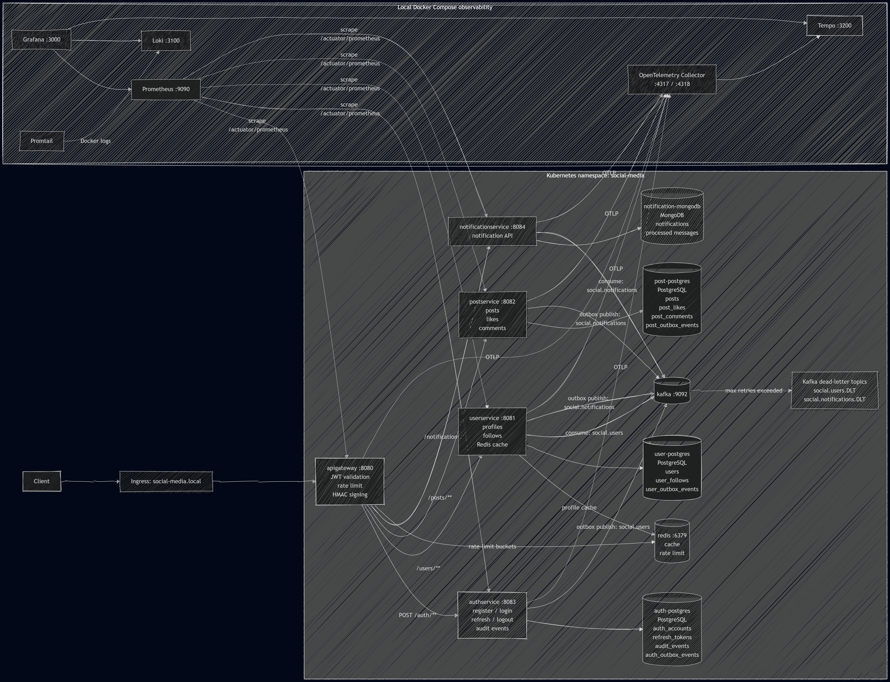
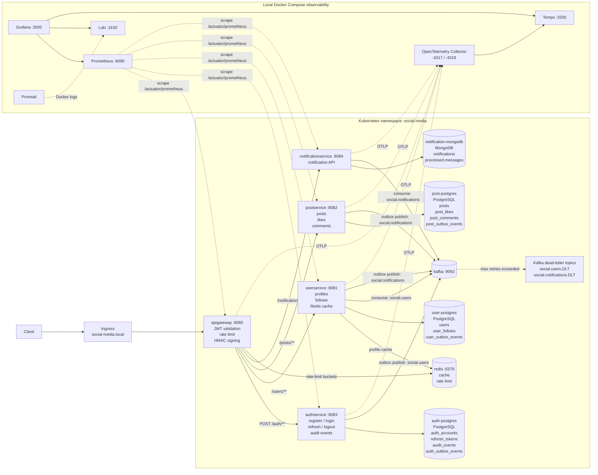

# Architecture

## Mermaid Source

```mermaid
flowchart LR
    Client[Client]
    Ingress[Ingress<br/>social-media.local]

    subgraph K8s["Kubernetes namespace: social-media"]
        Gateway[apigateway :8080<br/>JWT validation<br/>rate limit<br/>HMAC signing]

        Auth[authservice :8083<br/>register / login<br/>refresh / logout<br/>audit events]
        Users[userservice :8081<br/>profiles<br/>follows<br/>Redis cache]
        Posts[postservice :8082<br/>posts<br/>likes<br/>comments]
        Notifications[notificationservice :8084<br/>notification API]

        Kafka[(kafka :9092)]
        AuthPostgres[(auth-postgres<br/>PostgreSQL<br/>auth_accounts<br/>refresh_tokens<br/>audit_events<br/>auth_outbox_events)]
        UserPostgres[(user-postgres<br/>PostgreSQL<br/>users<br/>user_follows<br/>user_outbox_events)]
        PostPostgres[(post-postgres<br/>PostgreSQL<br/>posts<br/>post_likes<br/>post_comments<br/>post_outbox_events)]
        NotificationMongo[(notification-mongodb<br/>MongoDB<br/>notifications<br/>processed messages)]
        Redis[(redis :6379<br/>cache<br/>rate limit)]
        Dlt[Kafka dead-letter topics<br/>social.users.DLT<br/>social.notifications.DLT]
    end

    subgraph Obs["Local Docker Compose observability"]
        Grafana[Grafana :3000]
        Prometheus[Prometheus :9090]
        Loki[Loki :3100]
        Tempo[Tempo :3200]
        OTel[OpenTelemetry Collector<br/>:4317 / :4318]
        Promtail[Promtail]
    end

    Client --> Ingress
    Ingress --> Gateway

    Gateway -->|POST /auth/**| Auth
    Gateway -->|/users/**| Users
    Gateway -->|/posts/**| Posts
    Gateway -->|/notifications/**| Notifications

    Gateway -->|rate-limit buckets| Redis
    Users -->|profile cache| Redis

    Auth --> AuthPostgres
    Users --> UserPostgres
    Posts --> PostPostgres
    Notifications --> NotificationMongo

    Auth -->|outbox publish: social.users| Kafka
    Users -->|consume: social.users| Kafka
    Users -->|outbox publish: social.notifications| Kafka
    Posts -->|outbox publish: social.notifications| Kafka
    Notifications -->|consume: social.notifications| Kafka
    Kafka -. max retries exceeded .-> Dlt

    Gateway -. OTLP .-> OTel
    Auth -. OTLP .-> OTel
    Users -. OTLP .-> OTel
    Posts -. OTLP .-> OTel
    Notifications -. OTLP .-> OTel
    OTel --> Tempo

    Prometheus -. scrape /actuator/prometheus .-> Gateway
    Prometheus -. scrape /actuator/prometheus .-> Auth
    Prometheus -. scrape /actuator/prometheus .-> Users
    Prometheus -. scrape /actuator/prometheus .-> Posts
    Prometheus -. scrape /actuator/prometheus .-> Notifications

    Promtail -. Docker logs .-> Loki
    Grafana --> Prometheus
    Grafana --> Loki
    Grafana --> Tempo
```
